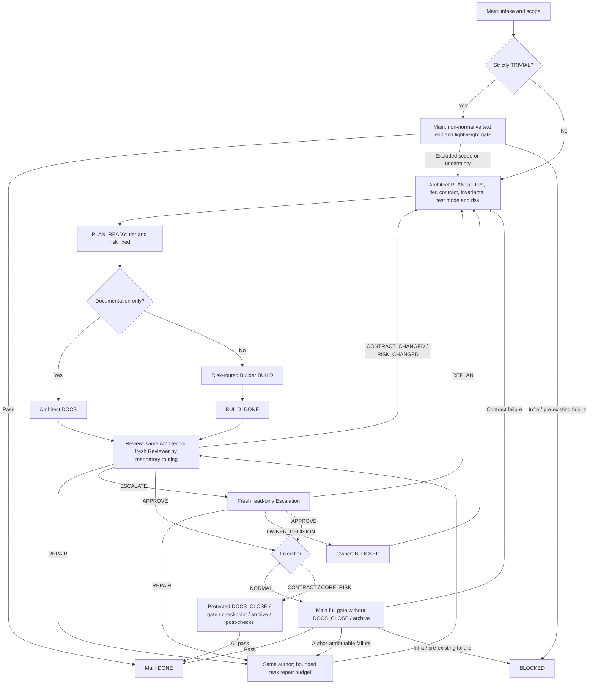

# MULTIAGENT: lean GPT-6 workflow

## Purpose and activation

This is the normative workflow when `.codex/config.toml` contains exact Boolean `[agents].enabled = true` at task start. Main owns task intake, scope coordination, routing, the full gate and final DONE. Main alone spawns project subagents; subagents never spawn subagents. Mode remains fixed for the task.

Use native Codex project roles from `.codex/agents/**`, or `codex queue` for user-created Codex sessions. Do not invoke Orca or `orca-cli` unless the user explicitly requests Orca in the current task. The owner owns intent, scope decisions and explicit risk downgrades. Main communicates at phase boundaries and blockers; apart from strictly TRIVIAL edits below, it does not implement, redesign, duplicate normal review or classify risk. DEFAULT retains its independent Control/Developer workflow; these tiers do not change it.

## Task tiers and Main's direct-edit boundary

Main decides only strictly TRIVIAL or not TRIVIAL. TRIVIAL means clearly non-normative text/docs only: no source code, configuration, scripts, OpenSpec, ADRs, workflow/skills or normative docs; no API/path/code rename or behavioral meaning change. Main may fix wording or formatting only while it can preserve factual claims and link/path targets. Source comments are not TRIVIAL; a non-normative file location alone does not prove eligibility.

Any exclusion or uncertainty goes to Architect before dependent work. Main must not evaluate TR triggers, select NORMAL/CONTRACT/CORE_RISK, or repair code/configuration/policy under the TRIVIAL exception. TRIVIAL has no subagents, OpenSpec, review, overlap check, DOCS_CLOSE or archive. TRIVIAL runs git diff --check and mvnw.cmd -Dtest=RepositoryConventionsTest test; both must pass with required tests actually executed before DONE. Main may correct its own still-TRIVIAL text; other failures go to Architect or remain BLOCKED for infrastructure/pre-existing causes. No new repair budget is created.

Architect evaluates all TR triggers before NORMAL or CONTRACT. Any match requires CORE_RISK; unresolved credible trigger uncertainty selects CORE_RISK. With none, NORMAL preserves accepted observable behavior; CONTRACT changes observable/public or accepted behavior. When unsure, uncertainty between NORMAL and CONTRACT selects CONTRACT; mixed scope takes the highest applicable tier. Telemetry, logging, internal refactors, test-only work, non-security config and source comments are examples only after trigger assessment, not exemptions. A new promised telemetry contract is CONTRACT without a trigger; telemetry affecting authoritative evidence or security follows the matching TR.

NORMAL contract uses the existing handoff with accepted-source paths, scope, test mode, invariants and budget. NORMAL skips OpenSpec, overlap checks, DOCS_CLOSE and archive, but retains Architect PLAN, risk-routed Builder, same-Architect review and Main's complete gate. A bugfix restoring accepted behavior can be NORMAL; changing accepted behavior is CONTRACT, and any TR match overrides either. CONTRACT and CORE_RISK require OpenSpec and full protected archive closure. Do not invent a proposal, state file or task registry for NORMAL.

## Roles and model routing

| Role or fixed risk | Model / effort | Project role |
|---|---|---|
| Main | gpt-6-sol / medium | Main session |
| Architect | gpt-6-sol / high | architect |
| ROUTINE Builder | gpt-6-luna / xhigh | builder_luna_xhigh |
| STANDARD Builder | gpt-6-luna / max | builder_luna_max |
| CORE_RISK Builder | gpt-6-sol / medium | builder_sol |
| Fresh Reviewer | gpt-6-sol / medium | reviewer |
| Fresh Escalation | gpt-6-sol / high | escalation |

Builder risk routing is independent of NORMAL versus CONTRACT. It follows Architect's fixed ROUTINE/STANDARD/CORE_RISK risk below, not a fixed tier-to-Luna mapping. Separate Luna role files pin their efforts because custom role settings take precedence over dispatch overrides. Documentation-only work stays with Architect and skips Builder. Historical benchmarks do not change this routing.

## Architect planning and risk

Architect is the sole risk classifier. In PLAN, Architect reads controlling sources, inspects existing code and tests, and owns the non-TRIVIAL tier, contract, invariants, plan, test mode and bounded budget. Main supplies scope evidence without a preliminary risk classification. Architect returns PLAN_READY only for a testable implementation-ready contract; CONTRACT/CORE_RISK additionally require strictly valid active OpenSpec artifacts.

Before PLAN_READY for CONTRACT and CORE_RISK, Architect runs `openspec list`, inspects which other active changes touch the same specs, and records the overlaps in the PLAN_READY handoff: `none`, or each change with a disposition of `resolve first`, `safe to proceed` or `blocked`. Resolve a `resolve first` overlap before proceeding; do not issue PLAN_READY while an overlap is `blocked`. TRIVIAL and NORMAL require no overlap check.

The following is the single authoritative trigger list. Other active guidance references it instead of defining another. Any matched trigger requires CORE_RISK. With none, Architect chooses ROUTINE for a small, well-understood bounded change or STANDARD for work needing broader implementation reasoning and records the reason.

CORE_RISK triggers: persistence semantics and the remaining numbered categories below.

| ID | Trigger |
|---|---|
| TR-01 | Persistence semantics |
| TR-02 | Transactions |
| TR-03 | Concurrency or locking |
| TR-04 | Idempotency or retry |
| TR-05 | Migrations or data loss |
| TR-06 | Point-in-time correctness |
| TR-07 | Financial values or exact arithmetic |
| TR-08 | Identity or ordering |
| TR-09 | Provider gaps, reconnect or recovery |
| TR-10 | Module boundaries |
| TR-11 | Reproducibility or integrity |
| TR-12 | Security or secrets |

Architect records the procedural tier, matched IDs and reasons, applicable [core invariants](CORE_INVARIANTS.md) and controlling sources, and `test_mode = RED_REQUIRED | RED_NOT_REQUIRED` in the existing contract/handoff. Each capsule carries `risk_triggers = matched triggers | none`; none requires an assessment against the list. Tier is an attribute, not a new state or file.

Risk remains fixed during implementation, review and repairs. Only explicit owner direction may lower risk. Tier also remains fixed at PLAN_READY. New scope returns to Architect with `reason = CONTRACT_CHANGED`, adding `subreason = RISK_CHANGED` when risk changes. Architect updates the contract and issues a new PLAN_READY before dependent work continues; Main selects a new Builder if required. A newly discovered observable-contract change during NORMAL requires this replan and OpenSpec before continuation as CONTRACT or CORE_RISK. Ordinary repairs do not reclassify risk.

Architect phases are PLAN, DOCS, REVIEW, REPAIR, DOCS_CLOSE and ARCHIVE. DOCS authors documentation; REPAIR fixes Architect-authored documentation; REVIEW is eligible only under the rule below. Only Architect may issue a new PLAN_READY. A semantic change found outside PLAN returns ESCALATE with CONTRACT_CHANGED to reopen PLAN, not a premature ready plan.

## Builder and behavioral evidence

CORE_RISK and every bugfix require RED_REQUIRED; other CONTRACT work uses Architect-selected test mode with a concrete reason; other NORMAL work uses useful appropriate tests, with the reason recorded in the existing test-mode handoff. RED_NOT_REQUIRED removes only test-first sequencing, not coverage or applicable verification; documentation-only CORE_RISK has no RED waiver. Report the blocker if meaningful executable RED cannot be established rather than fabricate failure or downgrade the task.

Builder owns implementation, requirement-derived tests, targeted GREEN and bounded repairs in one thread. For RED_REQUIRED it writes the smallest meaningful tests first and accepts RED only when the named test executes and fails at the expected behavioral assertion. Before implementation, record:

- changed test paths and the exact targeted command;
- for each failing test, requirement/acceptance-criterion, named test, failing assertion and expected/actual result.

Builder verifies the RED reason before semantic freeze, then implements without another Main RED turn, runs targeted GREEN and returns BUILD_DONE with the assertion, expected/actual and `tests_changed_after_red`. RED/test-freeze content hashes and pre-implementation-diff snapshots are not required. Stable review diffs, ordinary verification output and archive/checkpoint/recovery hashes remain required for their own purposes. RED_NOT_REQUIRED records Architect's reason and applicable checks without artificial failure or process-only evidence. Selecting RED voluntarily invokes the same semantic freeze.

Compilation, discovery, configuration, startup, Docker and infrastructure failure are not RED. Use real PostgreSQL through Testcontainers when [Testing](TESTING.md) requires it. On Windows under Codex, Docker Desktop named pipes may be inaccessible in the restricted sandbox. Run `docker version` and every Docker/Testcontainers command with escalated host access. Retry in-sandbox permission denial, discovery timeout or `docker_engine is not listening` once in that host context. This infrastructure retry is not RED or a repair round. Docker is unavailable only if same-context host `docker version` fails.

After verified RED and semantic freeze under [Testing](TESTING.md#agent-assisted-development), never change, weaken, skip, narrow, retag, reconfigure, regenerate or relocate establishing tests, expectations, fixtures, snapshots, discovery or runtime settings. Production behavior must not recognize a test artifact. A post-freeze necessary test change or suspected test/spec conflict returns BLOCKED with `blocked_reason = TEST_SPEC_ERROR` and exact evidence. The current reviewer alone may authorize correction through REPAIR with `requires_new_red = true`; establish new behavioral RED before resuming implementation. Report authorized changes honestly in `tests_changed_after_red`; the reviewer verifies final tests still encode the intended behavior. Contract defects reopen Architect PLAN.

Builder writes only implementation/test paths within the contract, does not update OpenSpec or documentation and does not run the complete repository gate. Main owns that gate.

## Review routing

- NORMAL / CONTRACT → same Architect thread.
- Any CORE_RISK change → fresh Reviewer (new thread).

CORE_RISK takes precedence, including documentation-only work. An accepted normative-spec change alone does not require fresh review when no TR trigger exists, including a CONTRACT delta intended for archive. Reuse Architect for eligible review. Start independent Reviewer in a new thread; it may review the task's bounded repairs. Reviewer is read-only. The current reviewer means the role selected by this rule.

Review receives the fixed contract, invariants, budget, stable diff, tests, test mode and compact RED/GREEN evidence. Prioritize correctness and integrity over style. NORMAL/CONTRACT review reports only touched CI; CORE_RISK review reports the full CI-01..CI-15 matrix using `Invariant | Applicable | Evidence | Verdict`, with a reason for every non-applicable invariant. Verify final test meaning, not merely the author's evidence claim. Return one consolidated APPROVE, REPAIR, ESCALATE or BLOCKED. Main reruns claimed RED only when the current reviewer sets `red_suspect = true`.

## Repair and escalation

Implementation or test repairs return to the same Builder, then BUILD_DONE and review. Documentation repairs return to the same Architect, then review. Consolidate the author, bounded changes and checks. There are two ordinary repair passes, `repair_round = 1` and `repair_round = 2`. The current reviewer authorizes the third repair with `repair_round = 3` and `third_repair_authorized = true`; Main routes it without a separate owner turn. Every repair receives review. No fourth ordinary repair is permitted.

If the same Builder or Reviewer session cannot be resumed, Main starts a fresh session of the same role and configured model/effort, passing the contract, current diff, RED/GREEN evidence, open review items and remaining repair budget. Keep the repair count, preserve Reviewer independence, and state in the handoff that the session was replaced. Session loss alone is not an owner decision.

Replanning and escalation never reset the repair budget. A substantive defect surviving round three, an unresolved technical dispute or inability to state a bounded safe repair goes to a fresh Sol High Escalation thread. Earlier technical escalation is allowed when accepted sources cannot resolve the exact question. Escalation is read-only and receives one bounded question, contract, invariants, diff, tests and evidence. It does not restart the project or expand scope.

Escalation returns exactly one attribute:

```text
verdict = REPAIR | REPLAN | APPROVE | OWNER_DECISION
```

| Verdict | Canonical status and route |
|---|---|
| REPAIR | REPAIR → same author, remaining repair budget, then review |
| REPLAN | REPLAN → ESCALATE; Architect receives CONTRACT_CHANGED / ESCALATION_REPLAN and issues the new PLAN_READY after planning |
| APPROVE | APPROVE → approval closure |
| OWNER_DECISION | OWNER_DECISION → BLOCKED; request the owner's concrete decision |

Escalation cannot add repair capacity. If its proposed repair has no remaining authorized round, Main returns BLOCKED for an owner decision. REPLAN and OWNER_DECISION are verdict attributes, not workflow states. Owner intent or scope ambiguity goes directly to the owner without technical escalation. Owner direction returns to Architect PLAN where needed.

## States and task capsule

The only workflow states are:

```text
PLAN_READY BUILD_DONE REPAIR APPROVE BLOCKED ESCALATE DONE
```

Each subagent response starts `STATUS: <state>` compatible with its role and phase. Main alone returns DONE. A missing, unknown or incompatible status receives one protocol correction without consuming an artifact repair. Reasons and attributes add no states:

```text
risk = ROUTINE | STANDARD | CORE_RISK
risk_triggers = matched triggers | none
test_mode = RED_REQUIRED | RED_NOT_REQUIRED
tests_changed_after_red = true | false | not_applicable
reason = CONTRACT_CHANGED | OTHER
subreason = RISK_CHANGED | ESCALATION_REPLAN | OTHER
blocked_reason = TEST_SPEC_ERROR | CONTRACT_ERROR | INFRASTRUCTURE | PREEXISTING | OWNER_DECISION | OTHER
requires_new_red = true | false
repair_round = 1 | 2 | 3
third_repair_authorized = true | false
red_suspect = true | false
```

Each new agent receives a self-contained capsule without conversation history:

```text
Goal and owner scope:
Phase: PLAN | DOCS | BUILD | REVIEW | REPAIR | DOCS_CLOSE | ARCHIVE | CHALLENGE
Fixed tier, risk and risk_triggers (Architect supplies these in PLAN):
Test mode and reason:
Active OpenSpec change/scenario IDs when required; accepted-source contract for NORMAL:
Applicable invariants and controlling sources:
Change budget and author-owned paths:
Files to read:
Checks to run:
Evidence supplied:
Repair accounting and authorization:
Expected status and return route:
```

## Stable write policy

Architect may write the active change, task-scoped docs and README when required. Accepted main specs change only through authorized sync/archive after verification. Architect may not write production code or tests, AGENTS.md, `.codex/**`, build/runtime configuration, governance documents or accepted ADR decisions unless the owner explicitly authorized those exact changes. Builder may write only authorized implementation and tests. Neither role silently changes architecture, dependencies, migrations, public contracts, fallback behavior or unrelated modules. Reviewer and Escalation are read-only.

After APPROVE for CONTRACT/CORE_RISK, Architect performs DOCS_CLOSE: completion status, verified task checkboxes, evidence links and non-semantic documentation only. It does not archive yet. NORMAL has no DOCS_CLOSE; any required accompanying documentation is authored by Architect in DOCS before review. Semantic changes return to PLAN with `reason = CONTRACT_CHANGED`, new validation and applicable review.

## End-to-end flow

CONTRACT/CORE_RISK: APPROVE → Architect DOCS_CLOSE → Main complete final gate → Main checkpoint → Architect CLI archive → Main post-checks → Main DONE.

NORMAL runs Main's complete final gate after same-Architect APPROVE, then Main DONE without archive. TRIVIAL uses only its two-check gate after Main edits.

Read [the closure procedure](agents/close-archive.md) only before DOCS_CLOSE, complete final gate, archive, archive recovery or post-archive work. Ordinary PLAN, BUILD and REVIEW do not load it. NORMAL needs its applicable full-gate section only; TRIVIAL does not load it. Main retains full-gate, exact mutation inspection, post-check and final DONE ownership.



The author-completion edge includes Builder BUILD_DONE before review; Architect documentation completion returns to review without self-approval. Fresh-review precedence applies at every review. CONTRACT_CHANGED, RISK_CHANGED, REPLAN and OWNER_DECISION are reasons or verdict attributes, not new states. Non-semantic documentation defects return to Architect REPAIR; semantic defects return to PLAN. BLOCKED returns to the gate only after its condition is resolved, never as an automatic retry loop. Closure failure routes and recovery detail are in the conditional procedure; all repairs and recovery retain the same task budget.

## Main context discipline

Main requests bounded findings with exact source paths, commands, outcomes and unresolved issues from the appropriate existing role. Deep inspection of large sources, raw logs, reports or complete diffs belongs to Architect, Builder, Reviewer or Escalation under current ownership. Main may inspect exact relevant excerpts for routing, blockers, its full gate and archive mutation checks; short summaries never excuse missing failures, applicable invariant evidence or required checks.

Existing OpenSpec artifacts, code/tests, existing test reports and authorized telemetry retain durable truth after summaries, compaction or session replacement. Conversation summaries provide navigation, not replacement evidence. Introduce no state, capsule or evidence file solely for context management; preserve existing self-contained handoff and lost-session recovery responsibilities.

Gate output uses plain shell redirection or an existing mechanism to retain full output, outside any directory deleted by Maven clean. Save the exact command's exit code immediately, before formatting or log searches. PASS includes the exact command/check, exit status and compact available counts (tests, failures, errors and skipped); do not invent counts. FAIL includes the exact command, exit code, failed test/check/plugin, a bounded relevant error excerpt and the path to full output. Report remaining unrun checks. A required skipped or missing check is not PASS even with exit code zero; no output filter may hide failure or substitute a formatter's exit status. Required checks and failure ownership remain unchanged; no wrapper or state/evidence infrastructure is added.

## Assignment telemetry

Use `.codex/scripts/log-agent-activity.ps1` only for benchmark, debug or explicitly requested measurement, not ordinary development. Preserve event format and aggregation when used; this optional measurement does not remove contract, review or verification evidence. Role/phase/status allowlists follow this workflow; logging does not decide risk, approval or repair authority. Score test quality separately from behavior: meaningful RED, real infrastructure where needed, determinism, durable-state assertions, rollback, retry and controlled test mutations.
