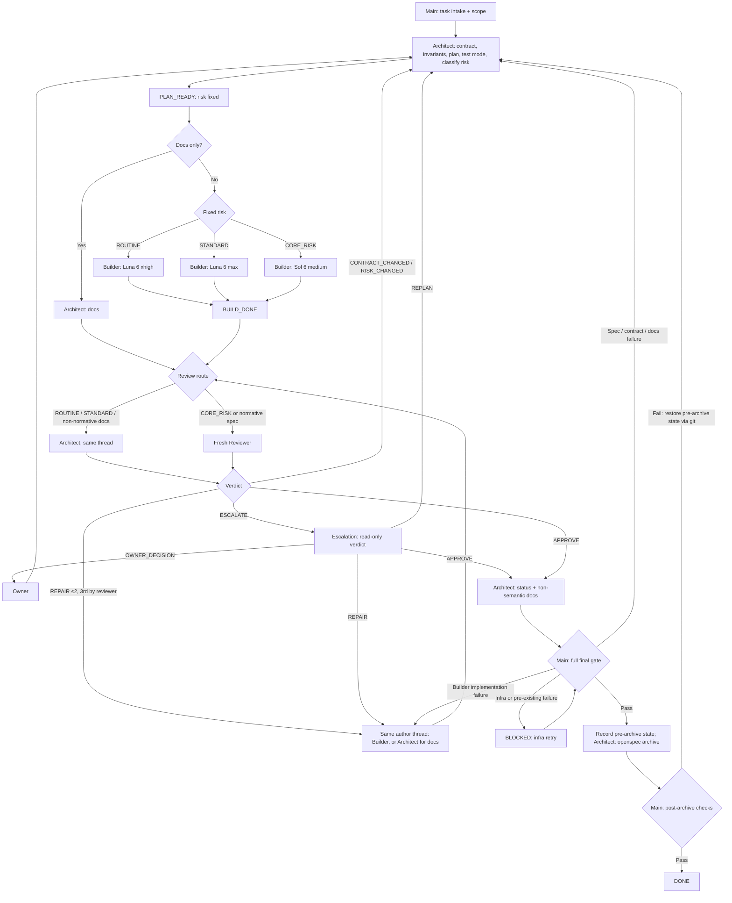

# MULTIAGENT: lean GPT-6 workflow

## Purpose and activation

This is the normative workflow when `.codex/config.toml` contains exact Boolean `[agents].enabled = true` at task start. Main owns task intake, scope coordination, routing, the full gate and final DONE. Main alone spawns project subagents; subagents never spawn subagents. Mode remains fixed for the task.

Use native Codex project roles from `.codex/agents/**`, or `codex queue` for user-created Codex sessions. Do not invoke Orca or `orca-cli` unless the user explicitly requests Orca in the current task. The owner owns intent, scope decisions and explicit risk downgrades. Main communicates at phase boundaries and blockers; it does not implement, redesign, duplicate normal review or classify risk.

## Roles and model routing

| Role or fixed risk | Model / effort | Project role |
|---|---|---|
| Main | gpt-6-sol / medium | Main session |
| Architect | gpt-6-sol / high | architect |
| ROUTINE Builder | gpt-6-luna / xhigh | builder_luna_xhigh |
| STANDARD Builder | gpt-6-luna / max | builder_luna_max |
| CORE_RISK Builder | gpt-6-sol / medium | builder_sol |
| Fresh Reviewer | gpt-6-sol / medium | reviewer |
| Fresh Escalation | gpt-6-sol / high | escalation |

Builder routing follows Architect's fixed risk. Separate Luna role files pin their efforts because custom role settings take precedence over dispatch overrides. Documentation-only work stays with Architect and skips Builder. Historical benchmarks do not change this routing.

## Architect planning and risk

Architect is the sole risk classifier. In PLAN, Architect reads controlling sources, inspects existing code and tests, and owns the contract, invariants, plan, test mode and bounded budget. Main supplies scope evidence without a preliminary classification. Architect returns PLAN_READY only after the active OpenSpec artifacts are testable and strictly valid.

Before PLAN_READY, Architect runs `openspec list`, inspects which other active changes touch the same specs, and records the overlaps in the PLAN_READY handoff: `none`, or each change with a disposition of `resolve first`, `safe to proceed` or `blocked`. Resolve a `resolve first` overlap before proceeding; do not issue PLAN_READY while an overlap is `blocked`.

The following is the single authoritative trigger list. Other active guidance references it instead of defining another. Any matched trigger requires CORE_RISK. With none, Architect chooses ROUTINE for a small, well-understood bounded change or STANDARD for work needing broader implementation reasoning and records the reason.

CORE_RISK triggers: persistence semantics and the remaining numbered categories below.

| ID | Trigger |
|---|---|
| TR-01 | Persistence semantics |
| TR-02 | Transactions |
| TR-03 | Concurrency or locking |
| TR-04 | Idempotency or retry |
| TR-05 | Migrations or data loss |
| TR-06 | Point-in-time correctness |
| TR-07 | Financial values or exact arithmetic |
| TR-08 | Identity or ordering |
| TR-09 | Provider gaps, reconnect or recovery |
| TR-10 | Module boundaries |
| TR-11 | Reproducibility or integrity |
| TR-12 | Security or secrets |

Architect records matched IDs and reasons, applicable [core invariants](CORE_INVARIANTS.md) and controlling sources, and `test_mode = RED_REQUIRED | RED_NOT_REQUIRED`. Each capsule carries `risk_triggers = matched triggers | none`; none requires an assessment against the list.

Risk remains fixed during implementation, review and repairs. Only explicit owner direction may lower risk. New risk or scope evidence returns to Architect with `reason = CONTRACT_CHANGED` and `subreason = RISK_CHANGED`. Architect updates the contract and issues a new PLAN_READY before dependent work continues; Main selects a new Builder if required. Ordinary repairs do not reclassify risk.

Architect phases are PLAN, DOCS, REVIEW, REPAIR, DOCS_CLOSE and ARCHIVE. DOCS authors documentation; REPAIR fixes Architect-authored documentation; REVIEW is eligible only under the rule below. Only Architect may issue a new PLAN_READY. A semantic change found outside PLAN returns ESCALATE with CONTRACT_CHANGED to reopen PLAN, not a premature ready plan.

## Builder and behavioral evidence

Builder owns implementation, specification-derived tests, targeted GREEN and bounded repairs in one thread. For RED_REQUIRED it writes the smallest meaningful tests first and accepts RED only when the named test executes and fails at the expected behavioral assertion. Before implementation, record:

- changed test paths and content hash after RED;
- exact targeted command, named failing test and expected/actual assertion;
- Git diff captured before implementation.

Builder then implements without another Main RED turn, runs targeted GREEN, verifies the frozen hash and returns BUILD_DONE. Raw logs, timestamps, phase IDs and a separate production manifest are not required. RED_NOT_REQUIRED records Architect's reason and existing checks without artificial failure or a pre-implementation diff solely for process evidence.

Compilation, discovery, configuration, startup, Docker and infrastructure failure are not RED. Use real PostgreSQL through Testcontainers when [Testing](TESTING.md) requires it. On Windows under Codex, Docker Desktop named pipes may be inaccessible in the restricted sandbox. Run `docker version` and every Docker/Testcontainers command with escalated host access. Retry in-sandbox permission denial, discovery timeout or `docker_engine is not listening` once in that host context. This infrastructure retry is not RED or a repair round. Docker is unavailable only if same-context host `docker version` fails.

After verified RED and test freeze under [Testing](TESTING.md#agent-assisted-development), never weaken, skip, narrow, retag, reconfigure, regenerate or relocate establishing tests, expectations, fixtures, snapshots, discovery or runtime settings. Production behavior must not recognize a test artifact. A post-freeze suspected test/spec conflict returns BLOCKED with `blocked_reason = TEST_SPEC_ERROR` and exact evidence. The current reviewer alone may authorize correction through REPAIR with `requires_new_red = true`; establish new behavioral RED and a new hash before resuming implementation. Contract defects reopen Architect PLAN.

Builder writes only implementation/test paths within the contract, does not update OpenSpec or documentation and does not run the complete repository gate. Main owns that gate.

## Review routing

- ROUTINE / STANDARD implementation or non-normative docs → same Architect thread.
- Any CORE_RISK change → fresh Reviewer (new thread).
- Any change to an accepted normative OpenSpec spec → fresh Reviewer, regardless of risk.

Either fresh-review condition takes precedence, including documentation-only work. The accepted-spec condition includes a delta intended to change an accepted normative spec at archive. Reuse Architect for eligible review. Start independent Reviewer in a new thread; it may review the task's bounded repairs. Reviewer is read-only. The current reviewer means the role selected by this rule.

Review receives the fixed plan, invariants, budget, stable diff, tests, test mode and compact RED/GREEN evidence. Prioritize correctness and integrity over style. Before APPROVE, report every applicable invariant using `Invariant | Applicable | Evidence | Verdict`; non-applicability needs a reason. Return one consolidated APPROVE, REPAIR, ESCALATE or BLOCKED. Main reruns claimed RED only when the current reviewer sets `red_suspect = true`.

## Repair and escalation

Implementation or test repairs return to the same Builder, then BUILD_DONE and review. Documentation repairs return to the same Architect, then review. Consolidate the author, bounded changes and checks. There are two ordinary repair passes, `repair_round = 1` and `repair_round = 2`. The current reviewer authorizes the third repair with `repair_round = 3` and `third_repair_authorized = true`; Main routes it without a separate owner turn. Every repair receives review. No fourth ordinary repair is permitted.

If the same Builder or Reviewer session cannot be resumed, Main starts a fresh session of the same role and configured model/effort, passing the contract, current diff, RED/GREEN evidence, open review items and remaining repair budget. Keep the repair count, preserve Reviewer independence, and state in the handoff that the session was replaced. Session loss alone is not an owner decision.

Replanning and escalation never reset the repair budget. A substantive defect surviving round three, an unresolved technical dispute or inability to state a bounded safe repair goes to a fresh Sol High Escalation thread. Earlier technical escalation is allowed when accepted sources cannot resolve the exact question. Escalation is read-only and receives one bounded question, contract, invariants, diff, tests and evidence. It does not restart the project or expand scope.

Escalation returns exactly one attribute:

```text
verdict = REPAIR | REPLAN | APPROVE | OWNER_DECISION
```

| Verdict | Canonical status and route |
|---|---|
| REPAIR | REPAIR → same author, remaining repair budget, then review |
| REPLAN | REPLAN → ESCALATE; Architect receives CONTRACT_CHANGED / ESCALATION_REPLAN and issues the new PLAN_READY after planning |
| APPROVE | APPROVE → approval closure |
| OWNER_DECISION | OWNER_DECISION → BLOCKED; request the owner's concrete decision |

Escalation cannot add repair capacity. If its proposed repair has no remaining authorized round, Main returns BLOCKED for an owner decision. REPLAN and OWNER_DECISION are verdict attributes, not workflow states. Owner intent or scope ambiguity goes directly to the owner without technical escalation. Owner direction returns to Architect PLAN where needed.

## States and task capsule

The only workflow states are:

```text
PLAN_READY BUILD_DONE REPAIR APPROVE BLOCKED ESCALATE DONE
```

Each subagent response starts `STATUS: <state>` compatible with its role and phase. Main alone returns DONE. A missing, unknown or incompatible status receives one protocol correction without consuming an artifact repair. Reasons and attributes add no states:

```text
risk = ROUTINE | STANDARD | CORE_RISK
risk_triggers = matched triggers | none
test_mode = RED_REQUIRED | RED_NOT_REQUIRED
tests_changed_after_red = true | false | not_applicable
reason = CONTRACT_CHANGED | OTHER
subreason = RISK_CHANGED | ESCALATION_REPLAN | OTHER
blocked_reason = TEST_SPEC_ERROR | CONTRACT_ERROR | INFRASTRUCTURE | PREEXISTING | OWNER_DECISION | OTHER
requires_new_red = true | false
repair_round = 1 | 2 | 3
third_repair_authorized = true | false
red_suspect = true | false
```

Each new agent receives a self-contained capsule without conversation history:

```text
Goal and owner scope:
Phase: PLAN | DOCS | BUILD | REVIEW | REPAIR | DOCS_CLOSE | ARCHIVE | CHALLENGE
Fixed risk and risk_triggers (Architect supplies these in PLAN):
Test mode and reason:
Active OpenSpec change and scenario IDs:
Applicable invariants and controlling sources:
Change budget and author-owned paths:
Files to read:
Checks to run:
Evidence supplied:
Repair accounting and authorization:
Expected status and return route:
```

## Stable write policy

Architect may write the active change, task-scoped docs and README when required. Accepted main specs change only through authorized sync/archive after verification. Architect may not write production code or tests, AGENTS.md, `.codex/**`, build/runtime configuration, governance documents or accepted ADR decisions unless the owner explicitly authorized those exact changes. Builder may write only authorized implementation and tests. Neither role silently changes architecture, dependencies, migrations, public contracts, fallback behavior or unrelated modules. Reviewer and Escalation are read-only.

After APPROVE, Architect performs DOCS_CLOSE: completion status, verified task checkboxes, evidence links and non-semantic documentation only. It does not archive yet. Semantic changes return to PLAN with `reason = CONTRACT_CHANGED`, new validation and applicable review.

## End-to-end flow

The successful closure is APPROVE → DOCS_CLOSE → complete final gate → checkpoint → archive → post-checks → DONE.
The following owner-defined flow includes return paths:



The author-completion edge `SB --> H` includes Builder BUILD_DONE before review; Architect documentation completion returns directly to review. Review precedence still applies to H. CONTRACT_CHANGED, RISK_CHANGED, REPLAN and OWNER_DECISION describe reasons or verdicts, not extra states. The docs-failure edge returns non-semantic defects to Architect REPAIR and semantic defects to PLAN. BLOCKED returns to the gate only after the condition is resolved; it is not an automatic retry loop. All repair and recovery edges retain the same task budget.

## Complete final gate

Main runs from the repository root after DOCS_CLOSE:

```powershell
pwsh -NoProfile -File .codex/scripts/verify-test-integrity.ps1
mvnw.cmd clean verify
openspec validate --all --strict --no-interactive
openspec doctor
git diff --check
```

On Windows, first run `docker version` in the same escalated host access context used for Maven, outside the restricted sandbox. Preflight passes before Maven. Any nonzero required check blocks completion; never narrow or skip it. Route failures by ownership:

- implementation or test issue attributable to Builder → same Builder REPAIR, review and full gate;
- documentation or contract issue → Architect documentation REPAIR or PLAN with CONTRACT_CHANGED;
- infrastructure issue or unrelated pre-existing failure → BLOCKED with exact command and cause.

A Builder-attributable gate failure consumes the next existing repair round. The current reviewer must authorize round three; substantive blockers after it go to technical escalation. Infrastructure retries do not consume implementation repairs. The gate starts no new budget.

## Checkpoint, archive and recovery

After full-gate PASS, Main records `git status --porcelain=v1`, observed HEAD, real-index identity, exact task paths and prospective archive mutations. Create a pre-archive checkpoint using a temporary Git index and `commit-tree` held by a task-specific ref; leave the live branch and real index unchanged. Add only task-owned content and accepted specs needed by this archive to that temporary index. Exclude owner hunks, hooks and IDE/MCP files. If safe separation of shared paths cannot be proved, return BLOCKED.

Preserve raw-byte snapshots of active-change files and accepted specs using `hash-object -w --no-filters`, retaining blob IDs in the checkpoint tree/ref. Record path existence and SHA-256 beside porcelain status. Inspect attributes and filters: normal add/checkout may transform line endings. Prove the chosen literal-path restoration reproduces recorded hashes without changing the real index. Recheck HEAD and affected path hashes before archive; do not overwrite concurrent edits.

Main supplies the checkpoint to Architect, which runs `openspec archive <change-id> --yes`. Only this active change, its new dated archive copy and accepted specs declared by the delta may change. Main compares before/after porcelain status and exact path hashes against that allowlist and runs:

```powershell
openspec validate --all --strict --no-interactive
openspec doctor
mvnw.cmd -Dtest=RepositoryConventionsTest test
git diff --check
```

These post-archive checks supplement the complete gate. Main returns DONE only when they pass and the archive diff remains in scope.

On post-archive failure, first verify no concurrent edits to affected paths. Restore only exact paths changed by this archive from the checkpoint's raw bytes and original existence; remove only the new archive copy. Verify pre-archive hashes and the unchanged real index. Never reset-hard, use whole-tree checkout, git clean, stash owner work or hand-reverse accepted-spec patches. If scoped recovery cannot be proved safe, return BLOCKED before destructive action.

Return the restored active change to Architect for correction. Respect author ownership, reopen planning/review for semantic changes and retain repair accounting. Run the full gate, create a fresh checkpoint, archive and perform post-checks again. Recovery grants no unlimited retry loop.

## Assignment telemetry

Main uses `.codex/scripts/log-agent-activity.ps1` for dispatch/return timing and available token counters unless the task prohibits repository log writes. Preserve event format and aggregation. Role/phase/status allowlists follow this workflow; logging does not decide risk, approval or repair authority. Score test quality separately from behavior: meaningful RED, real infrastructure where needed, determinism, durable-state assertions, rollback, retry and controlled test mutations.
