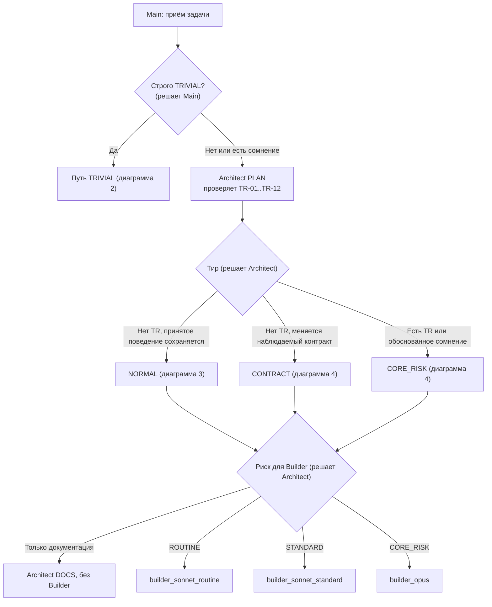
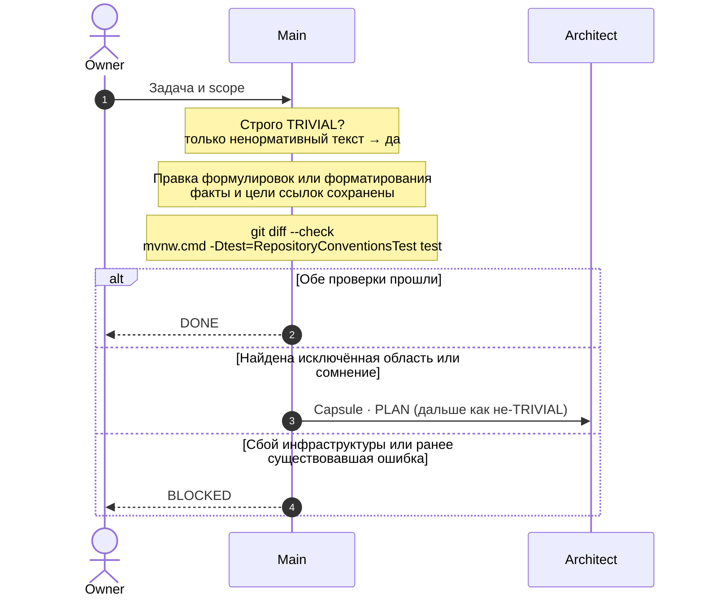
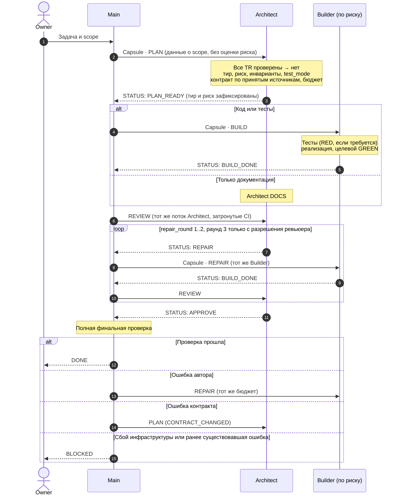
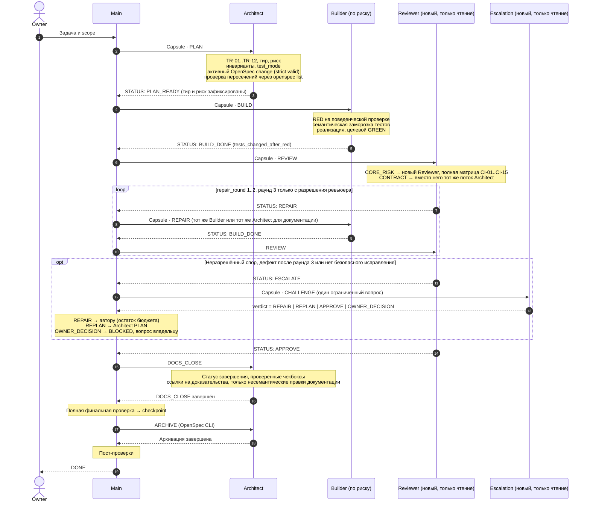
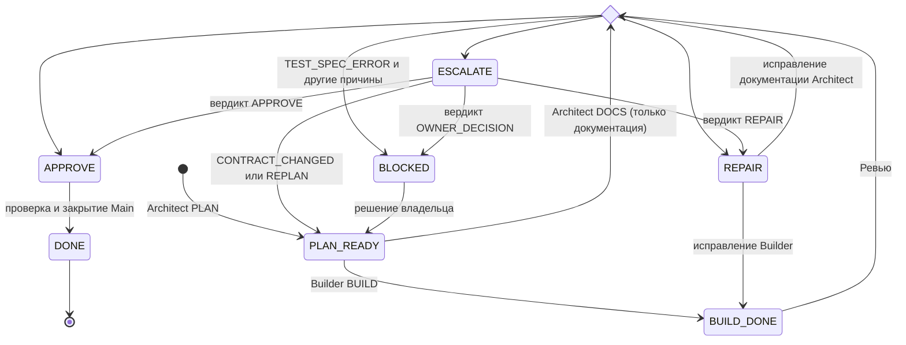

# Диаграммы MULTIAGENT workflow

Ненормативное визуальное приложение к [MULTIAGENT workflow](../AGENT_WORKFLOW_MULTIAGENT.md). При любом расхождении действует документ workflow. Детали закрытия описаны в [процедуре закрытия](../agents/close-archive.md).

Как читать: каждая колонка — роль. Сплошная стрелка — передача capsule с фазой; пунктирная — возвращённый `STATUS:`. `loop` — ограниченный бюджет исправлений, `opt` — необязательная ветка. Названия статусов, фаз и ролей оставлены как в workflow, потому что это идентификаторы.

## 1. Маршрутизация: кто берёт задачу

Кто делает ревью: NORMAL и CONTRACT проверяет тот же поток Architect; любую работу CORE_RISK, включая только документацию, проверяет новый Reviewer, который только читает.

## 2. TRIVIAL

Без субагентов, OpenSpec, ревью, проверки пересечений, DOCS_CLOSE и архивации.

## 3. NORMAL

Без OpenSpec, проверки пересечений, DOCS_CLOSE и архивации.

## 4. CONTRACT и CORE_RISK

## 5. Статусы

В workflow ровно семь состояний. Причины вроде `CONTRACT_CHANGED` и вердикты вроде `REPLAN` — это атрибуты, а не состояния.

## 6. Кто что может делать

| Роль | Фазы | Что пишет | Что возвращает |
|---|---|---|---|
| Owner | Намерение, scope, снижение риска | — | Решения |
| Main | Приём, правка TRIVIAL, маршрутизация, финальная проверка, checkpoint, пост-проверки | Только текст TRIVIAL | DONE |
| Architect | PLAN, DOCS, REVIEW (NORMAL/CONTRACT), REPAIR, DOCS_CLOSE, ARCHIVE | Активный change, документация задачи | PLAN_READY, APPROVE, REPAIR, ESCALATE, BLOCKED |
| Builder | BUILD, REPAIR | Реализация и тесты в рамках контракта | BUILD_DONE, BLOCKED |
| Reviewer | REVIEW (CORE_RISK) | Только чтение | APPROVE, REPAIR, ESCALATE, BLOCKED |
| Escalation | CHALLENGE | Только чтение | Атрибут verdict |
